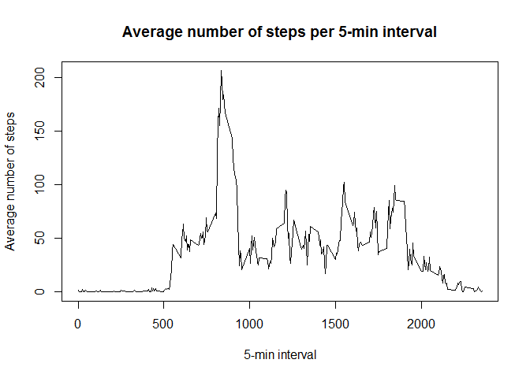
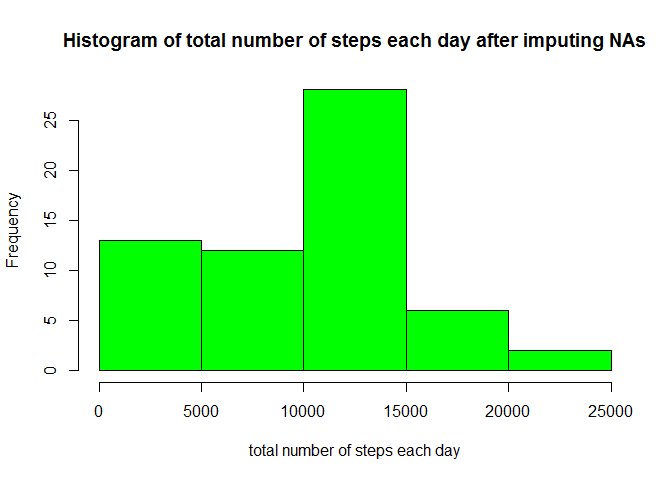
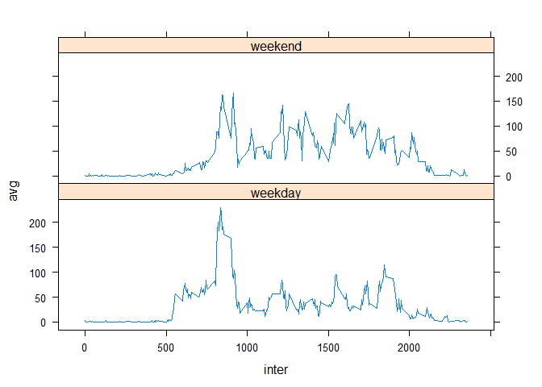

# Reproducible Research: Peer Assessment 1


## Loading and preprocessing the data

First we load the data, output to be stored in a variable "rdata"
Then we transform the "day" column into a Date variable


```r
dset <- read.csv("D:/RWSPACE/Project5_A1/activity.csv",header = TRUE)
dset <- transform(dset, date = as.Date(date))
```

```
## Warning in strptime(xx, f <- "%Y-%m-%d", tz = "GMT"): unable to identify current timezone 'M':
## please set environment variable 'TZ'
```

```
## Warning in strptime(xx, f <- "%Y-%m-%d", tz = "GMT"): unknown timezone
## 'localtime'
```


## What is mean total number of steps taken per day?

Make a histogram of the total number of steps taken each day
Used the aggregate function to calculate the total number of steps taken each day
hist function for plotting the histogram


```r
stepsum <- data.frame(aggregate(dset$steps,by=list(dset$date),sum,na.rm=TRUE))
names(stepsum) <- c("day","total.steps")
hist(stepsum$total.steps,xlab = "total number of steps each day",main = "Histogram of total number of steps each day", col="orange")
```


2. Calculate and report the mean and median total number of steps taken per day


```r
step.mean <- data.frame(aggregate(dset$steps,by=list(dset$date),mean,na.rm=TRUE))
names(step.mean) <- c("day","mean.steps")
step.median <- data.frame(aggregate(dset$steps,by=list(dset$date),median,na.rm=TRUE))
names(step.median) <- c("day","median.steps")
paste("Mean of total number of steps taken per day")
```

```
## [1] "Mean of total number of steps taken per day"
```

```r
step.mean
```

```
##           day mean.steps
## 1  2012-10-01        NaN
## 2  2012-10-02  0.4375000
## 3  2012-10-03 39.4166667
## 4  2012-10-04 42.0694444
## 5  2012-10-05 46.1597222
## 6  2012-10-06 53.5416667
## 7  2012-10-07 38.2465278
## 8  2012-10-08        NaN
## 9  2012-10-09 44.4826389
## 10 2012-10-10 34.3750000
## 11 2012-10-11 35.7777778
## 12 2012-10-12 60.3541667
## 13 2012-10-13 43.1458333
## 14 2012-10-14 52.4236111
## 15 2012-10-15 35.2048611
## 16 2012-10-16 52.3750000
## 17 2012-10-17 46.7083333
## 18 2012-10-18 34.9166667
## 19 2012-10-19 41.0729167
## 20 2012-10-20 36.0937500
## 21 2012-10-21 30.6284722
## 22 2012-10-22 46.7361111
## 23 2012-10-23 30.9652778
## 24 2012-10-24 29.0104167
## 25 2012-10-25  8.6527778
## 26 2012-10-26 23.5347222
## 27 2012-10-27 35.1354167
## 28 2012-10-28 39.7847222
## 29 2012-10-29 17.4236111
## 30 2012-10-30 34.0937500
## 31 2012-10-31 53.5208333
## 32 2012-11-01        NaN
## 33 2012-11-02 36.8055556
## 34 2012-11-03 36.7048611
## 35 2012-11-04        NaN
## 36 2012-11-05 36.2465278
## 37 2012-11-06 28.9375000
## 38 2012-11-07 44.7326389
## 39 2012-11-08 11.1770833
## 40 2012-11-09        NaN
## 41 2012-11-10        NaN
## 42 2012-11-11 43.7777778
## 43 2012-11-12 37.3784722
## 44 2012-11-13 25.4722222
## 45 2012-11-14        NaN
## 46 2012-11-15  0.1423611
## 47 2012-11-16 18.8923611
## 48 2012-11-17 49.7881944
## 49 2012-11-18 52.4652778
## 50 2012-11-19 30.6979167
## 51 2012-11-20 15.5277778
## 52 2012-11-21 44.3993056
## 53 2012-11-22 70.9270833
## 54 2012-11-23 73.5902778
## 55 2012-11-24 50.2708333
## 56 2012-11-25 41.0902778
## 57 2012-11-26 38.7569444
## 58 2012-11-27 47.3819444
## 59 2012-11-28 35.3576389
## 60 2012-11-29 24.4687500
## 61 2012-11-30        NaN
```

```r
paste("Median of total number of steps taken per day")
```

```
## [1] "Median of total number of steps taken per day"
```

```r
step.median
```

```
##           day median.steps
## 1  2012-10-01           NA
## 2  2012-10-02            0
## 3  2012-10-03            0
## 4  2012-10-04            0
## 5  2012-10-05            0
## 6  2012-10-06            0
## 7  2012-10-07            0
## 8  2012-10-08           NA
## 9  2012-10-09            0
## 10 2012-10-10            0
## 11 2012-10-11            0
## 12 2012-10-12            0
## 13 2012-10-13            0
## 14 2012-10-14            0
## 15 2012-10-15            0
## 16 2012-10-16            0
## 17 2012-10-17            0
## 18 2012-10-18            0
## 19 2012-10-19            0
## 20 2012-10-20            0
## 21 2012-10-21            0
## 22 2012-10-22            0
## 23 2012-10-23            0
## 24 2012-10-24            0
## 25 2012-10-25            0
## 26 2012-10-26            0
## 27 2012-10-27            0
## 28 2012-10-28            0
## 29 2012-10-29            0
## 30 2012-10-30            0
## 31 2012-10-31            0
## 32 2012-11-01           NA
## 33 2012-11-02            0
## 34 2012-11-03            0
## 35 2012-11-04           NA
## 36 2012-11-05            0
## 37 2012-11-06            0
## 38 2012-11-07            0
## 39 2012-11-08            0
## 40 2012-11-09           NA
## 41 2012-11-10           NA
## 42 2012-11-11            0
## 43 2012-11-12            0
## 44 2012-11-13            0
## 45 2012-11-14           NA
## 46 2012-11-15            0
## 47 2012-11-16            0
## 48 2012-11-17            0
## 49 2012-11-18            0
## 50 2012-11-19            0
## 51 2012-11-20            0
## 52 2012-11-21            0
## 53 2012-11-22            0
## 54 2012-11-23            0
## 55 2012-11-24            0
## 56 2012-11-25            0
## 57 2012-11-26            0
## 58 2012-11-27            0
## 59 2012-11-28            0
## 60 2012-11-29            0
## 61 2012-11-30           NA
```


## What is the average daily activity pattern?

1.A time series plot of the 5-minute interval (x-axis)
and the average number of steps taken, averaged across all days (y-axis)


```r
interval <- aggregate(dset$steps,by=list(dset$interval),mean,na.rm=TRUE)
names(interval) <- c("interv","average")
with(interval,plot(interv,average,type="l",xlab ="5-min interval",ylab = "Average number of steps",main = "Average number of steps per 5-min interval"))
```



The 5-minute interval, on average across all the days containing the maximum number of steps


```r
interval$interv[which.max(interval$average)]
```

```
## [1] 835
```


## Imputing missing values
1.Calculate and report the total number of missing values in the dataset


```r
total.NA <- length(dset$steps[is.na(dset$steps)==TRUE])
percent.NA <- total.NA/length(dset$steps)
sprintf("NA values represent %1.2f%% of the observations total number",100*percent.NA)
```

```
## [1] "NA values represent 13.11% of the observations total number"
```

2.Imputing the missing values by replace NAs by the mean of that 5-min interval


```r
imputed <- dset
##Code for imputing missing values
for(i in 1:17568){
      if (is.na(imputed$steps[i])==TRUE){
            indic <- imputed$interval[i]
            imputed$steps[i] <- interval$average[match(indic,interval$interv)]
      }
}
```

3.Make a histogram of the total number of steps taken each day (after imputing NAs)


```r
stepsum1 <- data.frame(aggregate(imputed$steps,by=list(imputed$date),sum,na.rm=TRUE))
names(stepsum1) <- c("day","total.steps")
hist(stepsum$total.steps,xlab = "total number of steps each day",main = "Histogram of total number of steps each day after imputing NAs", col="green")
```



4.Calculate and report the mean and median total number of steps taken per day


```r
step.mean_ <- data.frame(aggregate(imputed$steps,by=list(imputed$date),mean,na.rm=TRUE))
names(step.mean_) <- c("day","mean.steps")
step.median_ <- data.frame(aggregate(imputed$steps,by=list(imputed$date),median,na.rm=TRUE))
names(step.median_) <- c("day","median.steps")
paste("Mean of total number of steps taken per day")
```

```
## [1] "Mean of total number of steps taken per day"
```

```r
step.mean_
```

```
##           day mean.steps
## 1  2012-10-01 37.3825996
## 2  2012-10-02  0.4375000
## 3  2012-10-03 39.4166667
## 4  2012-10-04 42.0694444
## 5  2012-10-05 46.1597222
## 6  2012-10-06 53.5416667
## 7  2012-10-07 38.2465278
## 8  2012-10-08 37.3825996
## 9  2012-10-09 44.4826389
## 10 2012-10-10 34.3750000
## 11 2012-10-11 35.7777778
## 12 2012-10-12 60.3541667
## 13 2012-10-13 43.1458333
## 14 2012-10-14 52.4236111
## 15 2012-10-15 35.2048611
## 16 2012-10-16 52.3750000
## 17 2012-10-17 46.7083333
## 18 2012-10-18 34.9166667
## 19 2012-10-19 41.0729167
## 20 2012-10-20 36.0937500
## 21 2012-10-21 30.6284722
## 22 2012-10-22 46.7361111
## 23 2012-10-23 30.9652778
## 24 2012-10-24 29.0104167
## 25 2012-10-25  8.6527778
## 26 2012-10-26 23.5347222
## 27 2012-10-27 35.1354167
## 28 2012-10-28 39.7847222
## 29 2012-10-29 17.4236111
## 30 2012-10-30 34.0937500
## 31 2012-10-31 53.5208333
## 32 2012-11-01 37.3825996
## 33 2012-11-02 36.8055556
## 34 2012-11-03 36.7048611
## 35 2012-11-04 37.3825996
## 36 2012-11-05 36.2465278
## 37 2012-11-06 28.9375000
## 38 2012-11-07 44.7326389
## 39 2012-11-08 11.1770833
## 40 2012-11-09 37.3825996
## 41 2012-11-10 37.3825996
## 42 2012-11-11 43.7777778
## 43 2012-11-12 37.3784722
## 44 2012-11-13 25.4722222
## 45 2012-11-14 37.3825996
## 46 2012-11-15  0.1423611
## 47 2012-11-16 18.8923611
## 48 2012-11-17 49.7881944
## 49 2012-11-18 52.4652778
## 50 2012-11-19 30.6979167
## 51 2012-11-20 15.5277778
## 52 2012-11-21 44.3993056
## 53 2012-11-22 70.9270833
## 54 2012-11-23 73.5902778
## 55 2012-11-24 50.2708333
## 56 2012-11-25 41.0902778
## 57 2012-11-26 38.7569444
## 58 2012-11-27 47.3819444
## 59 2012-11-28 35.3576389
## 60 2012-11-29 24.4687500
## 61 2012-11-30 37.3825996
```

```r
paste("Median of total number of steps taken per day")
```

```
## [1] "Median of total number of steps taken per day"
```

```r
step.median_
```

```
##           day median.steps
## 1  2012-10-01     34.11321
## 2  2012-10-02      0.00000
## 3  2012-10-03      0.00000
## 4  2012-10-04      0.00000
## 5  2012-10-05      0.00000
## 6  2012-10-06      0.00000
## 7  2012-10-07      0.00000
## 8  2012-10-08     34.11321
## 9  2012-10-09      0.00000
## 10 2012-10-10      0.00000
## 11 2012-10-11      0.00000
## 12 2012-10-12      0.00000
## 13 2012-10-13      0.00000
## 14 2012-10-14      0.00000
## 15 2012-10-15      0.00000
## 16 2012-10-16      0.00000
## 17 2012-10-17      0.00000
## 18 2012-10-18      0.00000
## 19 2012-10-19      0.00000
## 20 2012-10-20      0.00000
## 21 2012-10-21      0.00000
## 22 2012-10-22      0.00000
## 23 2012-10-23      0.00000
## 24 2012-10-24      0.00000
## 25 2012-10-25      0.00000
## 26 2012-10-26      0.00000
## 27 2012-10-27      0.00000
## 28 2012-10-28      0.00000
## 29 2012-10-29      0.00000
## 30 2012-10-30      0.00000
## 31 2012-10-31      0.00000
## 32 2012-11-01     34.11321
## 33 2012-11-02      0.00000
## 34 2012-11-03      0.00000
## 35 2012-11-04     34.11321
## 36 2012-11-05      0.00000
## 37 2012-11-06      0.00000
## 38 2012-11-07      0.00000
## 39 2012-11-08      0.00000
## 40 2012-11-09     34.11321
## 41 2012-11-10     34.11321
## 42 2012-11-11      0.00000
## 43 2012-11-12      0.00000
## 44 2012-11-13      0.00000
## 45 2012-11-14     34.11321
## 46 2012-11-15      0.00000
## 47 2012-11-16      0.00000
## 48 2012-11-17      0.00000
## 49 2012-11-18      0.00000
## 50 2012-11-19      0.00000
## 51 2012-11-20      0.00000
## 52 2012-11-21      0.00000
## 53 2012-11-22      0.00000
## 54 2012-11-23      0.00000
## 55 2012-11-24      0.00000
## 56 2012-11-25      0.00000
## 57 2012-11-26      0.00000
## 58 2012-11-27      0.00000
## 59 2012-11-28      0.00000
## 60 2012-11-29      0.00000
## 61 2012-11-30     34.11321
```

We can notice Only NA values have changed into valid values, for the others, no changes were recorded 


## Are there differences in activity patterns between weekdays and weekends?

First, we create a new factor variable in the dataset with two levels - "weekday" and "weekend" indicating whether a given date is a weekday or weekend day


```r
library(dplyr)
```

```
## 
## Attaching package: 'dplyr'
```

```
## The following objects are masked from 'package:stats':
## 
##     filter, lag
```

```
## The following objects are masked from 'package:base':
## 
##     intersect, setdiff, setequal, union
```

```r
weekday <- mutate(imputed,category=weekdays(imputed$date))
for(i in 1:17568){
      if (weekday$category[i]=="samedi"|| weekday$category[i]=="dimanche"){
            weekday$category[i] <- paste("weekend")
      }
      else weekday$category[i] <- paste("weekday")
}
weekday <- transform(weekday,category=as.factor(category))
benchmark <- aggregate(weekday$steps,by=list(weekday$interval,weekday$category),mean)
names(benchmark) <- c("inter","category","avg")
```

Panel plot containing a time series plot of the 5-minute interval (x-axis) and the average number of steps taken, averaged across all weekday days or weekend days (y-axis)


```r
library(lattice)
xyplot(avg ~ inter | category, data = benchmark,layout=c(1,2), type="l",lty=1)
```



We notice that the maximum average number of steps isreached in weekdays, but in general, and accross the day, the activity is more important in weekends than in weekdays 
