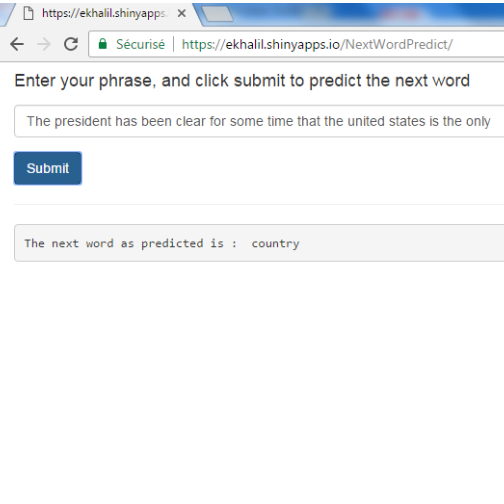

Capstone project Presentation
========================================================
author: Khalil ElKhiari
date: 03/27/2017
autosize: true
Next-word prediction App

Datasets and application summary
========================================================

In this project, the goal is building predictive text model like those used by SwiftKey. When someone types a word, the application predicts what the next word, will more likely be.

The dataset that was provided is an english data base, composed from 3 text documents: blogs, news and twitter. (https://d396qusza40orc.cloudfront.net/dsscapstone/dataset/Coursera-SwiftKey.zip)
Based on this corpus, we were able to build a huge number of tokens (n-grams).

We also download additional n-grams to make our model more powerful and accurate. {Davies, Mark. (2011) N-grams data from the Corpus of Contemporary American English (COCA). Downloaded from http://www.ngrams.info on January 23, 2017}

How it works : n-grams model
========================================================

A user have to type a phrase and click submit to see the next word as predicted by our model. 

First, the input text will go through some transformations (tolower, deleting some stop-words, remove numbers, ...) and calculate the number of characters. 

Based on this value, we will decide what the next word will more likely be, given that our algorithm support up to 5-grams.

Random phrase 
========================================================

As an example, we start with "The president" as an initial input, the phrase produced, by adding the predicted next word each time, is shown below :

App & code information
========================================================

-

This application could be found and tested here : 

https://ekhalil.shinyapps.io/NextWordPredict/

RPubs presentation : 

http://rpubs.com/d_scientist/NextWordPredict
